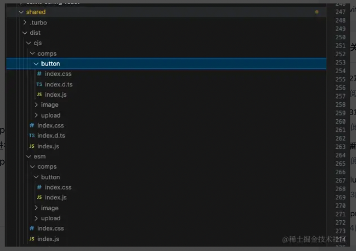
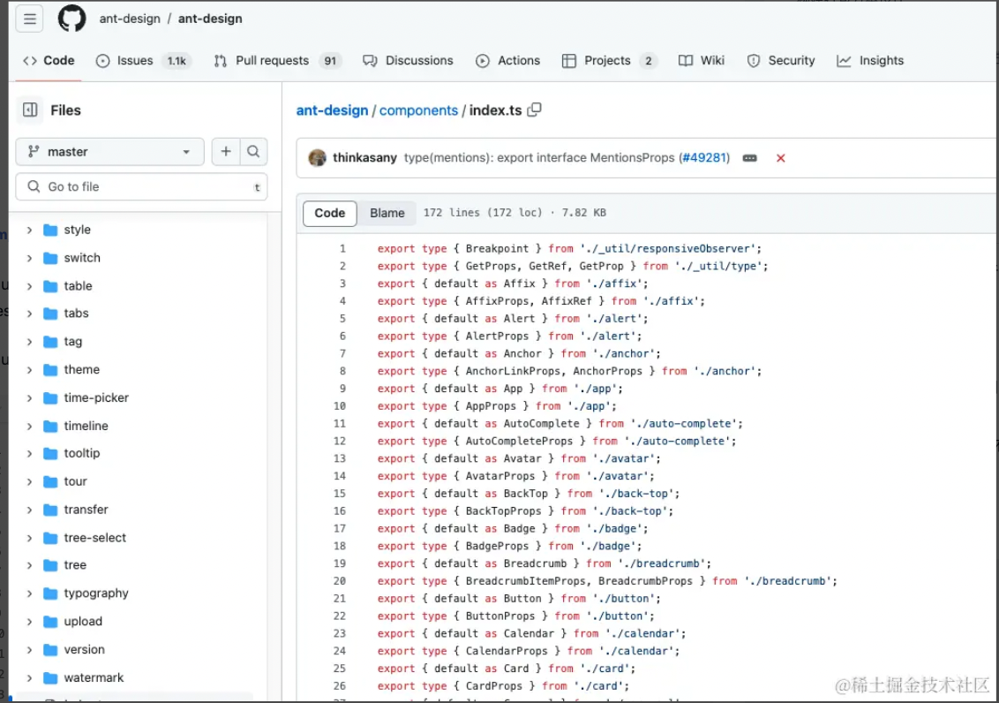
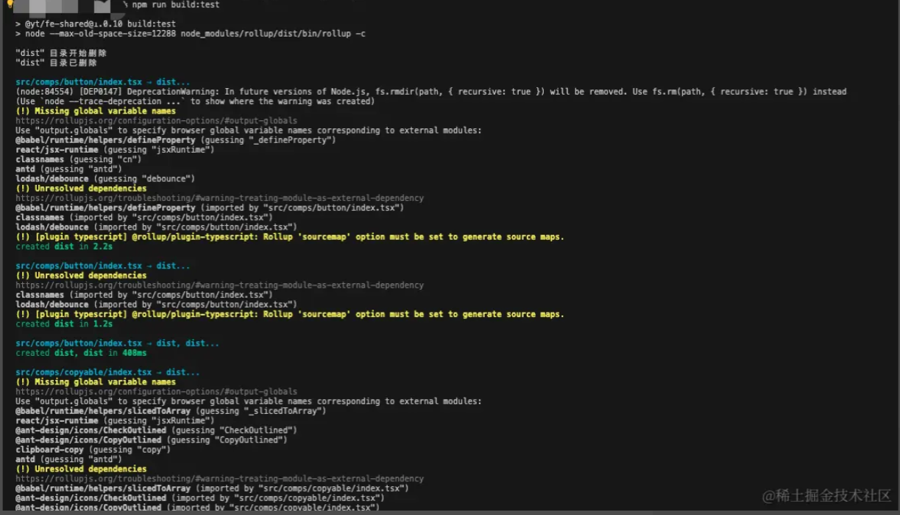
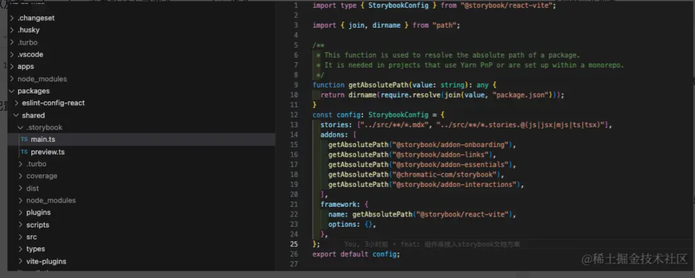
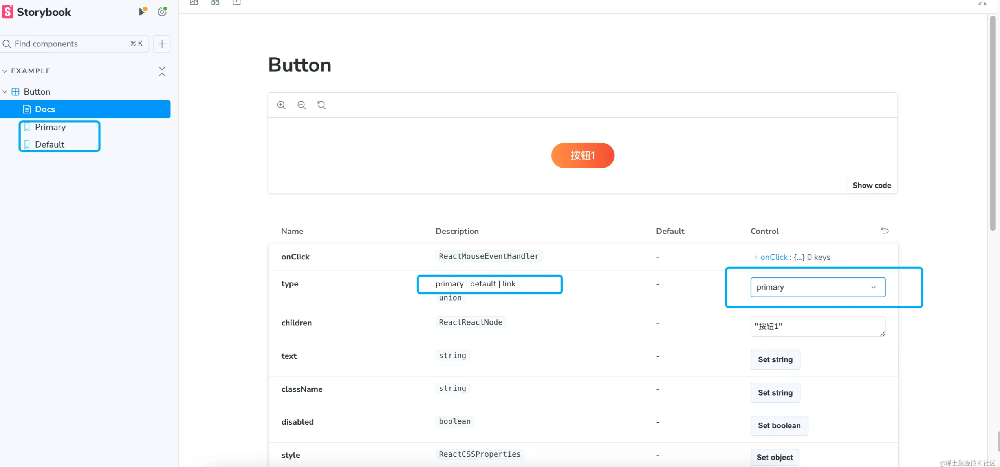

## 前言
   在谈到前端技术基础设施时，对于UI组件库建设几乎是一个绕不过的话题。日常业务迭代中经常会有着重复度极高的功能模块，对所使用到通用性强的工具类方法，UI组件等，通常都会进行抽象化，然后抽离封装为npm包。本文笔者将分享一下自己在从0到1搭建React组件库这一块的实践与思考

## 功能点与技术栈选型
  知识点总结
  
### 组件库技术选型：
  笔者公司是以react技术栈为主，所以组件库首选是react技术栈，因为是要自己从0到1搭建组件库，所以也没有考虑用dumi,father之类的一些npm包种子类库，构建工具选型的话就是用rollup ,react , 以及对antd的二次封装（内部需求大部分是对于antd进行扩展功能和自定义样式等）
  
### 知识点
#### 组件库的构建方案设计
  使用rollup作为底层构建工具，实现可按需加载的组件库，支持umd,esm两种格式产物，借助[vite-plugin-style-import](https://github.com/vbenjs/vite-plugin-style-import/tree/main#readme)实现组件样式按需加载
#### 组件样式
  采用经典的css-module组件样式方案
#### 组件单元测试 
  使用@testing-library/react + vitest 搭建单元测试
#### 组件库文档
 使用storyBook搭建组件库文档


## 组件库的构建方案

### 按需加载技术原理介绍
 现在社区上一些知名的的UI组件库大部分都支持按需加载组件，比如antd。那我们这个组件库也是需要如此。所谓组件按需加载的原理也很简单，其实就是每个组件单独打包产出
 各自的css,js产物，外部应用在使用时按需进行引入即可
#### babel-import-plugin

 比如拿antd举例，antd提供了babel-import-plugin插件，对import语法进行改写，babel-import-plugin插件有一个参数配置style，配置为true时，进行自动导入组件的css


babel配置
```
{
  "plugins": [
    ["import", {
      "libraryName": "antd",
      "libraryDirectory": "lib",
      "style": true
    }]
  ]
}

```

  ```tsx
   import { Button, Image } from 'antd'
   import 'antd/dist/antd.css'  //如果没有配置style=true，则需要手动全量引入所有组件的样式

  // 通过babel-import-plugin等插件，在代码编译时，对语句进行改写为
  var _button = require('antd/lib/button')
  require('antd/lib/button/style/css')

  var image = require('antd/lib/image')
  require('antd/lib/image/style/css')

  ```
 由此可见，只需要我们的组件库打包出如下格式的产物即可
 

 ``` 
  - dist
      button
       index.js
       index.css
       index.d.ts 
    index.js  //入口文件，包含所有的组件文件
       
 ```
#### tree-shaking

由于现在的构建工具，大多数都支持了tree-shaking(代码摇树)，所谓摇树就是针对没有import到的变量，函数等，在打包构建时自动去除这部分未使用到的代码，但前提是该产物必须是esm的产物，有保留import关键语句，因为tree-shaking的原理是根据静态分析import语句来收集各个模块的依赖关系，而在commonjs产物中，required引入是动态的，所以cjs的产物，构建工具无法做到tree-shaking

比如对于下面的代码中，业务工程的构建工具一般来说（现代化的构建工具比如rollup，vite，webpack等都支持tree-shaking）最终的构建产物只会包含包Button和Image两个组件,但是使用这种方案，对于组件的css是没有自动导入的，因为组件的样式文件并没有打包到js文件里面，而babel-import-plugin插件提供了style的参数配置来用于支持样式按需引入，我们后面也会使用类似的工具来实现（使用vite-plugin-style-import在vite应用上实现组件样式的按需加载）

使用
```tsx
   import { Button, Image } from 'antd'
```

组件库入口文件实现

```tsx
export { default as Button } from './button'
export { default as Image } from './Image'
```

我们接下来将开始设计组件库的构建方案，使其构建产物能够支持按需加载

### 构建打包方案设计
  有了上面的分析，对构建产物的格式也已经确定。梳理一下思路，我们需要把src下的所有一级子目录进行收集，然后交给rollup进行单独打包，最终把每份组件的源码输出在dist目录下
  
  
  **最终打包后的产物**




#### src目录下组件入口扫描  

要打包出上图的目录格式，rollup是需要多入口打包的，所以这里需要写一个通用的扫描规则，扫描规则是只对src目录下的第一级子目录进行扫描，并且只收集 `index[tsx|ts|js]`作为组件的入口文件,其他文件不作为打包入口，然后在生成rollup配置列表


写一个入口文件扫描函数

``` js

import fs from 'fs'
import path from 'path'

// 递归扫描目录，获取所有文件
function getAllFiles(srcpath) {
  const files = []
  const scanDir = dir => {
    const filesInDir = fs.readdirSync(dir)
    filesInDir.forEach(file => {
      const filePath = path.join(dir, file)
      if (fs.statSync(filePath).isDirectory()) {
        scanDir(filePath)
      } else {
        files.push(filePath)
      }
    })
  }
  scanDir(srcpath)
  return files
}


// 扫描入口文件
const getEntryConfig = (scanDir = './src', ignoreFileDir = ['business']) => {
  let entryPoints = {}
  getAllFiles(scanDir).forEach(filePath => {
    const ext = path.extname(filePath).toLowerCase()
    const [, dirName] = filePath.split('/')

    if (ignoreFileDir.includes(dirName)) {
      console.warn('entryPoints', entryPoints, dirName, filePath)

      return
    }
    const basename = path.basename(filePath)
    const relativePath = path.relative('./src', filePath)
    if (fs.statSync(filePath).isDirectory()) {
      return
    } else {
      const [fileName] = basename.split('.')

      if (fileName === 'index' && ['.tsx', '.js', '.ts'].includes(ext)) {
        const entryName = relativePath.replace(/\.(tsx|ts|js)$/, '')
        entryPoints[entryName] = filePath
      }
    }
  })

  return entryPoints
}

//执行getEntryConfig函数，可以得到这个对象
const _entryPoints = {
  'comps/button/index': 'src/comps/button/index.tsx',
  'comps/image/index': 'src/comps/image/index.tsx',
  'comps/upload/index': 'src/comps/upload/index.tsx',
}

```


##### 组件库源码目录结构

这是组件库整体的目录结构，入口文件是对组件的集合导出，antdUI库入口文件只导出组件本身和组件的props，我们也跟随如此 

```js

- src
   comps
     button
      index.tsx
      index.module.scss
     image
      index.tsx
      index.module.scss
  index.ts   


//入口文件 index.ts

export { default as Button } from './button'
export type { ButtonProps } from './button'

export { default as Image } from './image'
export type { ImageProps } from './button'

```



##### esm,cjs,dts构建产物

rollup的配置文件，如果是导出一个数组，则是多任务进行打包，有几个组件就会有几个打包任务， 编写一下esm,cjs，dts等三份产出配置生成

rollup配置文件

```js


import typescript from '@rollup/plugin-typescript'
import postcss from 'rollup-plugin-postcss'//提取组件css文件
import fs from 'fs'
import path from 'path'
import dts from 'rollup-plugin-dts' //生成组件的index.d.ts文件
import alias from '@rollup/plugin-alias'
import image from '@rollup/plugin-image'
import { babel } from '@rollup/plugin-babel'

// import del from 'rollup-plugin-delete'
// import babel from '@rollup/plugin-babel'
// import { terser } from 'rollup-plugin-terser'
// import {babel} from '@rollup/plugin-babel'
// import scss from 'rollup-plugin-scss'
// import replace from '@rollup/plugin-replace'
// import {nodeResolve} from '@rollup/plugin-node-resolve'
// import commonjs from '@rollup/plugin-commonjs'

// 递归扫描目录，获取所有文件
function getAllFiles(srcpath) {
  const files = []
  const scanDir = dir => {
    const filesInDir = fs.readdirSync(dir)
    filesInDir.forEach(file => {
      const filePath = path.join(dir, file)
      if (fs.statSync(filePath).isDirectory()) {
        scanDir(filePath)
      } else {
        files.push(filePath)
      }
    })
  }
  scanDir(srcpath)
  return files
}


const getEntryConfig = (scanDir = './src', ignoreFileDir = ['business']) => {
  let entryPoints = {}
  getAllFiles(scanDir).forEach(filePath => {
    const ext = path.extname(filePath).toLowerCase()
    const [, dirName] = filePath.split('/')

    if (ignoreFileDir.includes(dirName)) {
      console.warn('entryPoints', entryPoints, dirName, filePath)

      return
    }
    const basename = path.basename(filePath)
    const relativePath = path.relative('./src', filePath)
    if (fs.statSync(filePath).isDirectory()) {
      return
    } else {
      const [fileName] = basename.split('.')

      if (fileName === 'index' && ['.tsx', '.js', '.ts'].includes(ext)) {
        const entryName = relativePath.replace(/\.(tsx|ts|js)$/, '')
        entryPoints[entryName] = filePath
      }
    }
  })

  return entryPoints
}

const getCommonConfig = ({ inputKey, plugins = [], format = 'ems' }) => {
  const dir = format === 'esm' ? 'esm' : 'lib'

  const commonConfig = {
    external: ['react', 'react-dom', 'antd'],
    plugins: [
      alias({
        entries: [
          { find: '@', replacement: path.resolve('./src/') },
        ]
      }),
      image(),
      typescript(), //编译 TypeScript
      postcss({
        // modules: true,
        // extract: true,
        extract: `${dir}/${inputKey}.css`,
      }),
      ...plugins,
    ],
  }
  return commonConfig
}


const genlibConfig = (inputKey) => {

  const commonConfig = getCommonConfig({
    inputKey,
    format: 'lib',
    plugins: [
      babel({
        babelHelpers: 'runtime',
        exclude: ['./node_modules/@fx/ajax/**'],
        extensions: ['.ts', '.tsx', '.js', '.json', '.mjs'],
        presets: [
          [
            '@babel/preset-env',
            {
              modules: false,
              targets: {
                browsers: ['ie >= 11', 'chrome >= 49', 'ios >= 8', 'android >= 4.1'],
                node: '8',
              },
            },
          ],
        ],
        plugins: ['@babel/plugin-transform-runtime'],
      })
    ]
  })


  return {
    input: entryPoints[inputKey],
    output: {
      format: 'umd',
      name: 'ytShared',
      entryFileNames: `lib/${inputKey}.js`,
      globals: {
        react: 'React',
        'react-dom': 'ReactDOM',
      },
      dir: 'dist',
    },
    ...commonConfig,
  }

}

const genEsmConfig = (inputKey) => {

  const commonConfig = getCommonConfig({
    inputKey,
    format: 'esm',
  })
  return {
    input: entryPoints[inputKey],
    output: {
      format: 'esm',
      entryFileNames: `esm/${inputKey}.js`,
      globals: {
        react: 'React',
        'react-dom': 'ReactDOM',
      },
      dir: 'dist',
    }
    ,
    ...commonConfig,
  }

}

const genDtsConfig = (inputKey) => {
  const config = {
    input: entryPoints[inputKey],
    output: [
      {
        format: 'es',
        entryFileNames: `lib/${inputKey}.d.ts`,
        dir: 'dist',
      },
      {
        format: 'es',
        entryFileNames: `esm/${inputKey}.d.ts`,
        dir: 'dist',
      }
    ],
    external: ['react', 'react-dom', 'antd'], // 告诉 Rollup 将 React 视为外部依赖
    plugins: [
      dts(),
      // image(),
      alias({
        entries: [
          { find: '@', replacement: path.resolve('./src/') },
        ]
      }),
      // typescript(),
      // postcss({
      //   modules: true,
      //   extract: `esm/${inputKey}.css`,
      // }),
    ],
  }
  return config
}


function deleteDistDirectory() {
  const distPath = path.join(process.cwd(), 'dist')
  if (fs.existsSync(distPath)) {
    console.log('"dist" 目录开始删除')

    fs.rmdirSync(distPath, { recursive: true })
    console.log('"dist" 目录已删除')
  } else {
    console.log('当前目录下不存在 "dist" 目录')
  }

}
deleteDistDirectory()
const entryPoints = getEntryConfig()

// const _entryPoints = {
//   'comps/button/index': 'src/comps/button/index.tsx',
//   'comps/image/index': 'src/comps/image/index.tsx',
//   // 'comps/upload/index': 'src/comps/upload/index.tsx',
//   'index': 'src/index.ts',
// }

const outputs = Object.keys(entryPoints).flatMap((inputKey) => {
  return [
    genlibConfig(inputKey),
    genEsmConfig(inputKey),
    genDtsConfig(inputKey),
  ]
}).filter(Boolean)


export default outputs


```
这里我们指定了为每个组件都指定了三个打包任务，cjs是用于打包浏览器端umd格式的，同时为了兼容低版本浏览器，我们引入了babel对产物进行降级为es5，如果你开发的是一个底层的通用npm包，通常来说要提供三种格式产物，umd(用于支持浏览器环境)  , cjs（nodejs端使用），esm产物（现代浏览器esm能力的的使用，以vite为代表的构建工具），这也是目前npm包标准化的产物格式


##### rollup的构建优化


##### package.json编写
通过main和module，browser字段指定不同产物的入口文件，由于笔者公司是用的vite，所以是使用module对应的产物

```json
{
  "name": "your-package-name",
  "version": "1.0.0",
  "main": "./dist/esm/index.js",  
  "module": "./dist/esm/index.js", 
  "browser": "./dist/cjs/index.js",
  "scripts": {
    "lint": "eslint . --ext js,ts,tsx --fix",
    "build": "node --max-old-space-size=12288 node_modules/rollup/dist/bin/rollup -c",
    "eslint-es5": "eslint --no-eslintrc -c .eslintrc.es5.cjs --ext .js,.ts ./dist/**/*.js"
  }
}

```
执行npm run build，可以看到能够正常打包了 



至此，整个构建方案算是完成了，接一下需要在应用层接一下样式的按需引入


#### 使用vite-plugin-style-import进行样式按需引入
 业务应用层，使用该UI库正常方式引入组件即可，引入样式有两种方案，一种是全量引入
 
  ```tsx
 import { Button, Image } from '@yt/fe-shared'
 import '@yt/fe-shared/dist/esm/index.css'
 
 ```
另外一种是按需引入，按需引入需要借助vite-plugin-style-import这个插件来完成该功能，如果是webpack则可以使用babel-import-plugin，这个插件会分析匹配对应的import代码，自动帮补上所引入的组件的样式代码，下面是使用的示例
 
 正常引入组件库代码
 ```tsx
 import { Button, Image } from '@yt/fe-shared'
 
 ```
 **vite配置文件做修改**
 
 ```ts
 import {
  createStyleImportPlugin,
} from 'vite-plugin-style-import'

//这个函数可以由 UI库来实现并对外暴露，业务应用中引入进行使用即可
export function resolvelibStyleRule() {
 //这里是有样式文件的组件列表
  const comps = [
  'upload',
  'button',
  'image', 
  'modal', 
  'drawer'
  ]
  
  return {
    libraryName: '@yt/fe-shared',
    esModule: false,
    resolveStyle: (compName) => {
      if (comps.includes(compName)) {
        return `@yt/fe-shared/dist/esm/comps/${compName}/index.css`
      }
      return ''
    }
  }
}

 export default defineConfig(({ mode }) => {
  return {
    plugins: [
     createStyleImportPlugin({
        libs: [
          resolvelibStyleRule()
        ]
      })
    ]
   }
})
    
 ```

配置后，即可实现组件的样式按需加载

## react组件库单元测试

### vitest安装与初始化
测试框架这一块是选用的 [vitest](https://vitest.dev/) + [testing-library/react](https://github.com/testing-library/react-testing-library)， React Testing Library这个库也是目前社区较为流行的React组件测试工具，它为React应用提供了简单且强大的单元测试解决方案，该框架以其"以用户的方式思考"的理念，让开发者能够编写更接近真实用户交互的测试代码，从而提升测试覆盖率和代码质量


在package中加入以下代码，重新执行pnpm  install

```jsx
  "devDependencies": {
    "vite": "^5.0.10",
    "vitest": "1.6.0",
    "@testing-library/react": "^12.1.2",
    "@testing-library/react-hooks": "^8.0.1",
    "@vitest/coverage-v8": "^1.6.0",
    "jsdom": "^24.1.0"
  },
  "scripts": {
    "test": "sudo vitest run --coverage",
  }
```

然后在根目录下增加一个vite.config.ts文件,


```ts
import { defineConfig } from 'vitest/config'
import react from '@vitejs/plugin-react'

export default defineConfig({
  plugins: [react()],
  test: {
    watch: false,
    include: ['**/*.test.ts', '**/*.test.tsx'],
    globals: true,
    environment: 'jsdom',
    coverage: {
      enabled: true,
      reporter: ['text', 'html'],
      include: ['src/**/*.{js,ts,tsx}'],
      exclude: ['src/**/*.d.ts', 'src/index.ts', 'src/comps/index.ts', 'src/hooks/index.ts'],
    }
  }
})

```

### 编写测试用例
在button目录下，增加一个测试用例

**button.test.tsx**

```tsx
import { render, screen } from '@testing-library/react'
import { expect, test, vi, describe } from 'vitest'
import Button from './index'

describe('button', () => {
  test('测试button组件 disabled 状态', async () => {
    const handleClick = vi.fn()
    const { rerender } = render(<Button disabled onClick={handleClick}>Test Button</Button>)

    // 模拟点击事件
    const button = screen.getByText('Test Button')
    button.click()
    // 断言 onClick 未被调用
    expect(handleClick).not.toHaveBeenCalled()
    // 重新渲染为非禁用状态
    rerender(<Button onClick={handleClick}>Test2s Button1</Button>)

    button.click()

    // 断言 onClick 已被调用
    expect(handleClick).toHaveBeenCalledTimes(1)
  })

  test('测试button组件渲染传入的内容是否正确', () => {
    const { getByText } = render(<Button>刘德华</Button>)
    const buttonText = getByText('刘德华')
    expect(buttonText).toBeDefined()
  })


  test('测试button组件的点击防抖处理', async () => {
    const handleClick = vi.fn()
    const { getByText, rerender } = render(<Button useDebounceClick debounceInterval={500} onClick={handleClick} > 防抖测试按钮</Button>)

    const button = getByText('防抖测试按钮')

    // 模拟 debounceInterval时间内 连续点击
    button.click()
    button.click()
    button.click()
    button.click()
    button.click()

    // 等待一段时间，确保防抖生效
    await new Promise((resolve) => setTimeout(resolve, 400))

    button.click()
    // 断言 onClick 只被调用了一次
    expect(handleClick).toHaveBeenCalledTimes(1)

    handleClick.mockClear()
    rerender(<Button onClick={handleClick} useDebounceClick={false} debounceInterval={500} >防抖测试按钮</Button>)

    // 模拟 debounceInterval时间内 连续点击
    button.click()
    button.click()
    button.click()
    expect(handleClick).toHaveBeenCalledTimes(3)
  })

})
```

**button组件源码**

```tsx
import styles from './index.module.scss'
import React from 'react'
import cn from 'classnames'
import { Button, Tooltip } from 'antd'
import type { ButtonProps as AntdBtnProps } from 'antd/es/button'
import type { TooltipProps } from 'antd/es/tooltip'
import debounce from 'lodash/debounce'


type OrgBtnProps = Omit<AntdBtnProps, 'type'>

interface ButtonProps extends OrgBtnProps {
  text?: string
  type?: 'primary' | 'default' | AntdBtnProps['type']
  children?: React.ReactNode
  className?: string
  onClick?: React.MouseEventHandler<HTMLDivElement>
  disabled?: boolean
  style?: React.CSSProperties
  useDebounceClick?: boolean //启用快速点击防抖模式
  debounceInterval?: number   //防抖时间间隔
  tooltipText?: string
  toolTipsProps?: TooltipProps
  useAntdStyle?: boolean
}

const stylesMap: any = {
  default: styles.default,
  primary: styles.primary
}

const AntButton: React.FC<ButtonProps> = (props) => {
  const { type = 'default', disabled = false, debounceInterval = 600, useAntdStyle = false, useDebounceClick = true, style } = props
  const btnTypes = ['primary', 'default']

  const includeType = React.useMemo(() => {
    return btnTypes.includes(type)
  }, [type])

  const clickCallBackRef = React.useRef<any>(() => { })

  clickCallBackRef.current = (evt: any) => {
    if (disabled) return
    if (props?.onClick) {
      props?.onClick(evt)
    }
  }

  const debounceClickFn: React.MouseEventHandler<HTMLDivElement> = React.useCallback(debounce(() => {
    clickCallBackRef.current()
  }, debounceInterval, {
    leading: true,
    trailing: false
  }), [])

  if (useAntdStyle) {

    if (props?.tooltipText) {
      return <Tooltip  {...props?.toolTipsProps || {}} title={props.tooltipText}>
        <Button
          style={style}
          type={type}
          className={cn(props.className)}
          onClick={useDebounceClick ? debounceClickFn : clickCallBackRef.current}
          disabled={disabled}
          loading={props?.loading}
        >
          {props.children}
        </Button>
      </Tooltip>
    }

    return <Button
      style={style}
      type={type}
      className={cn(props.className)}
      onClick={useDebounceClick ? debounceClickFn : clickCallBackRef.current}
      disabled={disabled}
      loading={props?.loading}
    >
      {props.children}
    </Button>
  }

  if (props?.tooltipText) {
    return <Tooltip  {...props?.toolTipsProps || {}} title={props.tooltipText}>
      <Button
        style={style}
        className={cn(
          {
            [styles.disabled]: disabled,
            [styles.button]: true,
            [stylesMap[type]]: includeType
          },
          props.className
        )}
        onClick={useDebounceClick ? debounceClickFn : clickCallBackRef.current}
        disabled={disabled}
        loading={props?.loading}
      >
        {props.children}
      </Button>
    </Tooltip>
  }


  return (
    <Button
      style={style}
      className={cn(
        {
          [styles.disabled]: disabled,
          [styles.button]: true,
          [stylesMap[type]]: includeType
        },
        props.className
      )}
      onClick={useDebounceClick ? debounceClickFn : clickCallBackRef.current}
      disabled={disabled}
      loading={props?.loading}
    >
      {props.children}
    </Button>
  )
}
export default React.memo(AntButton)

```
执行npm run test,可以看到已经有对应的测试用例报告了


## 组件文档方案
  组件库文档这一块的技术选型是使用社区内大名鼎鼎的[Storybook](  https://github.com/storybookjs/storybook),Storybook拥有着丰富的功能，它可以用可视化的方式呈现组件状态、也能支持在页面视图中直接修改组件props并实时预览，以及根据ts自动生成文档，组件视觉测试等等，静态站点部署功能等

### 初始化Storybook
在项目跟目录中执行初始化指令，执行成功后，storybook会自动在根目录生成一个.storybook在根目录，以及在package.json中自动加入了两个npm scripts指令
```bash
pnpm dlx storybook@latest init
```

配置文件



可以看到生成的配置文件中,有着stories字段的配置，该字段会收集src下的所有的 `**.stories.**`文件作为一个个故事进行收集并生成文档，我们只需要为每个组件编写对应的stories文件即可


package中也加入了两条指令,执行npm run storybook即可在6006端口看到dev组件文档库了

``` json 
  "storybook": "storybook dev -p 6006",
  "build-storybook": "storybook build",
```
### 为组件编写stories文件

在button组件目录下新增一个`Button.stories.ts`文件，文件内容如下

``` ts
import type { Meta, StoryObj } from '@storybook/react'
import { fn } from '@storybook/test'
import Button from './index'

//组件的元数据描述信息
// More on how to set up stories at: https://storybook.js.org/docs/writing-stories#default-export
const meta = {
  title: 'Example/Button', 
  component: Button,
  parameters: {
    // Optional parameter to center the component in the Canvas. More info: https://storybook.js.org/docs/configure/story-layout
    layout: 'centered',
  },
  // This component will have an automatically generated Autodocs entry: https://storybook.js.org/docs/writing-docs/autodocs
  tags: ['autodocs'],
  argTypes: { //按钮的props声明，如果这里有传递，则会为组件的props添加上
    type: {
      name: 'type',
      type: 'string',
      description: 'primary | default | link',
      options: [ 
        'primary',
        'default',
        'link'
      ],
      control: 'select'  //以下拉框的形式进行展示
    },
    useAntdStyle: {
      control: 'boolean',
      description: '是否使用antd 默认样式',
      // defaultValue: 10,
    },
  },
  // More on argTypes: https://storybook.js.org/docs/api/argtypes
  // argTypes: {
  // backgroundColor: { control: 'color' },
  // },
  // Use `fn` to spy on the onClick arg, which will appear in the actions panel once invoked: https://storybook.js.org/docs/essentials/actions#action-args
  args: {
    onClick: () => { //组件的点击事件
      console.log('点击事件被触发')
      fn()
    }
  },
} satisfies Meta<typeof Button>

export default meta

type Story = StoryObj<typeof meta>;

// More on writing stories with args: https://storybook.js.org/docs/writing-stories/args

//为该组件导出两个故事状态
export const Primary: Story = {   
  args: {
    type: 'primary',
    children: '按钮1',
  },
}

export const Default: Story = {
  args: {
    type: 'default',
    children: '按钮2',
  },
}

```

此时可以看到6006端口的页面已经自动刷新了，组件的props 字段 描述也可以正常显示 ，然后也支持以可视化的方式切换组件props,组件可实时渲染和预览



### 文档静态化部署
最后在执行一下npm run build-storybook，根目录下会生成storybook-static目录，该目录就是静态页面站点，把这个站点部署到上自己的服务器，组件库文档就已经搭建完成啦，其实storybook的功能还有能多，比如组件的UI自动化测试，交互测试等，感兴趣的可以去尝试下

## 最后

通过以上的搭建步骤，一个基础的组件库框架已经基本成型了。但其实还遗留下了很多优化工作，比如组件构建以及发包的流程化定制，rollup的构建优化等，目前的构建方案如果组件数量过多的话会有构建时长问题，每次修改即使是一行代码，也是会走组件的全量构建，rollup目前还没有提供增量构建的方案，要做的话，只能是写个脚本通过git获取到有修改的文件l列表，筛选出对应的组件按需来进行构建。这些都是属于属于非必需的需求，等后面手头时间空闲了在回来研究


