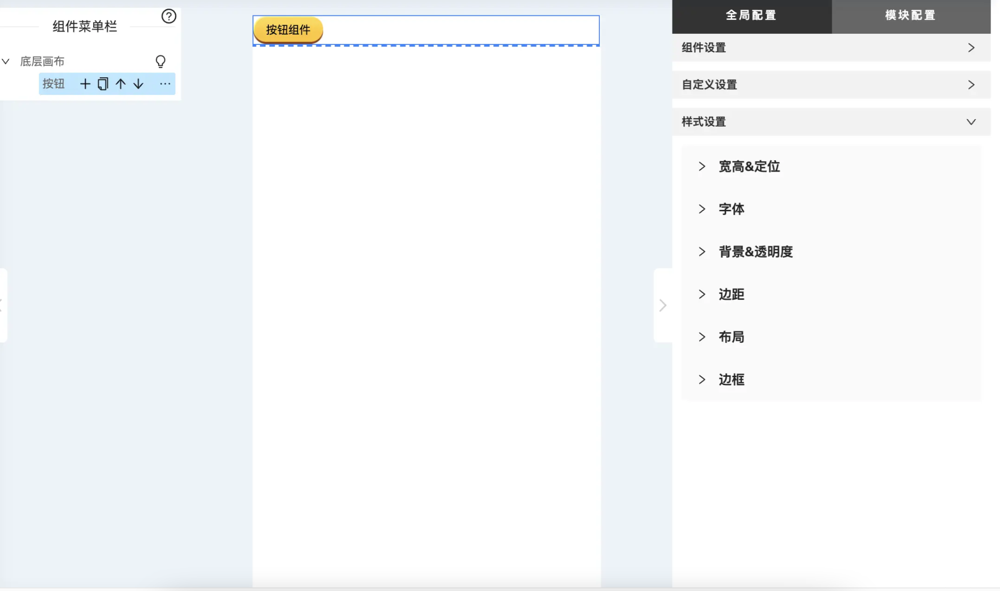

## 背景

公司各业务线经常会制作一些活动页面用于活动的推广营销，拉新留存，这类页面布局类似，需求高频，迭代快速，开发任务重复且消耗各方的沟通时间和人力。为了解决这些痛点提高人效，需要为业务提供一套简单易用，功能强大的可视化搭建平台

## 技术设计

现前端三大框架都推崇组件化开发模式，因为组件化方式有着高内聚低耦合，复用性高且方便扩展的优势。那页面可视化搭建能不能也沿用组件化的思维呢？答案是肯定的。试想一下，我们可以规划出一个积木组件的聚合平台，用户可以在平台上随意挑选组件并拖拽插入画布中，通过以组装积木的方式来生成页面。平台只负责收集展示组件，借助组件props特性，修改组件的props参数值能够实现动态编辑能力。那这些积木可以是由各业务侧去自行扩展。而公司内部正在推行的`EMP微前端解决方案`可以很方便的解决组件扩展问题，其原理是利用webpack5的`module-federation`特性来做到各应用的组件共享

**最终平台呈现效果：**


**页面创建流程**

1.  运营人员创建空白页面
2.  通过组件列表筛选组件拖拽进入画布（页面预览区域）
3.  使用右侧编辑器为组件动态赋能（修改组件props）
4.  保存页面（发布测试）
5.  通过预发布环境对页面进行测试
6.  发布页面（正式上线）

### 整体技术架构

最终的技术栈选型是`react+ hooks+ ts`，同时采用使用公司自研[EMP微前端解决方案](https://github.com/efoxTeam/emp)作为底层技术支撑，推出基于基站的开发模式，以主基站+业务基站进行业务扩展。主基站负责组件的收集与渲染工作，业务基站只负责实现各自的业务组件，各基站独立部署，没有中心基座的限制。


## 技术要点

**核心功能**

*   页面数据json化与组件树数据模型设计
*   获取远程应用对外共享的组件与组件异步渲染
*   组件接入规范设计
*   组件数据配置器
*   实时编辑预览效果实现
*   样式编辑器实现

**其他功能**

*   跨组件通信

### 页面数据json化与组件树数据模型设计

可视化编辑的本质是把页面抽象为json类型的数据结构，同时赋予增删改的能力，页面的渲染只需要针对这一套数据实现对应的渲染器（CSR/SSR）即可

*   页面数据json设计

编辑平台一般都具有保存与发布两种操作，保存用于保存页面编辑状态，而发布用于为页面进行发布上线。这两套页面数据是独立分开的，因为保存操作不能影响之前发布的页面数据，那具体的页面数据可以分别是两个接口来存储，或是同一个接口但使用不同的字段来区分

```tsx

  const pageData = {
     pageId:'6988736888656330',
     test: {   // 保存操作后的页面数据
         pageConfig:{
           title: '页面标题',
           theme: 'blue'，
           keywords: '',
           description: '',
         },
         pdList:[]  //页面组件树
     },
     prod: {    // 发布操作后的页面数据
         pageConfig:{
           title: '页面标题',
           theme: 'blue'，
           keywords: '',
           description: '',
         },
         pdList:[]  //页面组件树
     }
  }
```

*   页面组件树json结构设计

    画布布局方式采用了较为灵活的流式布局，而业务场景需支持组件能够多层级的嵌套，所以页面组件树的数据结构设计需要是可递归的结构

```tsx
 const tree = {
     id: 'App',
     rm: {
       rmn: 'topic_emp_base',      //远程模块名
       rmp: './EMPBaseContainer',  //组件路径
     },
  chs: [
   {
     id: 'App_3966',
     img: 'https://xxx',
     rm: {
       http: {
         prod: 'https://xxx',  
         test: 'https://xxx',
         dev: 'https://xxx',
          pathname: 'topic_emp_base.js',       //js名
          projectName: 'Base',       //远程项目名
         moduleName: 'topic_emp_base',   //远程模块名
       },
       rmn: 'topic_emp_base',              //组件所在的远程模块名
       rmp: './components/Base/NewTab_1.1',    //组件路径
     },
     name: '通用tab',
     chs: [],
     extend: {},
     pid: 'App',
    }
 ],
}
  
```

### 获取远程应用对外共享的组件与组件异步渲染

借助webpack5的`module-federation`能力，可以实现多个项目间的组件共享，平台要收集多个业务线对外暴露的组件，所以需要维护一份业务基站的映射关系，用于加载组件信息。它分别对应各子应用部署后js地址

*   业务组件库基站列表映射

```tsx
 {
  prod: 'https://qyxxx.com',
  test: 'https://qy-testxx.com',
  dev: 'https://qy-testxx.com',
  pathname: 'topic_emp_qingyujiaoyou.js',
  projectName: '轻语',
  title: '轻语专题平台',
  moduleName: 'topic_emp_qingyujiaoyou',
},
{
  prod: 'https://hagoxxx.net',
  test: 'https://hago-testxxx.net', 
  dev: 'https://hago-testxxx.net', 
  pathname: 'topic_emp_hago.js',
  projectName: 'Hago',
  title: 'Hago专题平台',
  moduleName: 'topic_emp_hago',
}
```

*   业务基站对外共享组件映射

    ```tsx

     './Tab': {
      path: 'src/components/Tab/index.tsx',
      img: 'https://xxx/61121b285e6bf953ccf6a244',
      catagary: ['基础'],
      name: ['通用tab'],
    },
    './components/Banner': {
      path: 'src/components/Banner/index',
      img: 'https://xxx/615fb3a8d4e653419f09b253',
      catagary: ['基础'],
      name: ['头图组件'],
    }

    ```

*   加载`module-federation`远程共享组件

```

async function clienLoadComponent({url, scope, module}) {
  await registerHost(url)
  await __webpack_init_sharing__('default')
  const container: any = window[scope]
  await container.init(__webpack_share_scopes__.default)
  const factory = await container.get(module)
  return factory()
}
const remoteHosts: any = {}
const registerHost = (url: string) => {
  return new Promise((resolve, reject) => {
    if (remoteHosts[url]) {
      resolve(true)
    }
    remoteHosts[url] = {}
    remoteHosts[url].element = document.createElement('script')
    remoteHosts[url].element.src = url
    remoteHosts[url].element.type = 'text/javascript'
    remoteHosts[url].element.async = true
    document.head.appendChild(remoteHosts[url].element)

    remoteHosts[url].element.onload = () => {
      resolve(true)
    }
    remoteHosts[url].element.onerror = () => {
      reject(false)
    }
  })
}


const ImageComp =  clienLoadComponent('https:xxx.js', 'topic_emp_base', './components/ImageComp')


```

### 组件接入规范设计

上诉部分只是设计了页面的渲染模式和组件的加载,要做到可视化编辑还需要为组件提供动态赋能的能力，所谓动态赋能就是能够为组件传入的props值提供动态可编辑的能力，可编辑这一部分可以通过表单配置的方式来实现。同时组件也要告知平台它需要怎样的动态参数，我们设计了empConfig字段来描述组件所需的动态类型

```tsx
import React from 'react'
import {EmpFC} from 'topic_emp_base/components/Base/type'
const Input = React.lazy(() => import('../../customConfig/input')) //配置器代码分割

interface ButtonProps {
  backgroundImage: string
  jsCode: string
  text: string
  buttonStatus: 'active' | 'invalid'
  unButtonBg: string
}


const Button: EmpFC<ButtonProps> = props => {

  const onClick = (event: any) => {
    props.jsCode && eval(props.jsCode)
  }
  
  const appid = props.empStore.useStore<GlobalStore>(state => state.appid)
  const isActive = props.buttonStatus === 'active'


  return (
    <>
      <div
        onClick={onClick}
        className={styles.container_button}
        style={{
          backgroundImage: `url(${isActive ? props.backgroundImage : props.unButtonBg})`,
        }}>
        {props.text}
      </div>
      <p>globalEmpConfigAppId:{appid}</p>
    </>
  )
}


Button.empConfig = {
  backgroundImage: {
    type: 'upload',       //图片上传
    defaultValue:'xxx',
    label: '按钮背景',
    group: '基础设置',
    weight: 100,
    options: {
      maxSize: 1024 * 300,
    },
  },
  text: {
    type: 'inputText',  //输入框
    defaultValue: '按钮文字',
    label: '按钮文字',
    group: '基础设置',
  },
  custom: {
    defaultValue: '',
    label: '自定义渲染配置器',
    group: '高级配置',
    type: 'custom',  //自定义配置器
    comp: (props: any) => {
      return <Input {...props} />
    },
  },
  extend:{
      styleEditable: true,
      styleAttr:['width','height','postion','top','left'],
      compMenuBar: {
          container: [
            {
              name: '容器盒子',
              alias: 'container',
            }
          ]
    }
  }
}

```

### 组件数据配置器

平台需要解析组件的EmpConfig静态属性，根据类型进行动态渲染，基于这套规则我们封装抽离出了低代码平台专用的动态表单库`EMPForm`

```tsx
 
 Button.empConfig = {
     style: {
      type: 'style',  //样式编辑器
      label: '标题样式编辑',
      group: '基础设置',
      weight: 1,
    },
    jsCode: {
      type: 'codeEditor',  //代码编辑器
      label: 'JS代码',
      defaultValue: 'alert("click")',
      group: '基础设置',
      weight: 1,
    },
    text: {
      type: 'inputText',  //输入框
      defaultValue: '按钮文字1',
      label: '按钮文字1',
      group: '基础设置',
      weight: 97,
    },
    select: {
      type: 'select',  //下拉框
      defaultValue: '按钮状态',
      label: '按钮状态',
      group: '基础设置',
      data:[
          {
              label:‘未激活按钮’，
              value:'未激活按钮'
          }，
           {
              label:‘激活按钮’，
              value:'激活按钮'
          }，
      ],
      weight: 97,
    },
}


```

*   EmpForm

```tsx

import EMPForm from 'src/base-components/setting/form/EmpForm'
import FormItem from 'src/base-components/setting/form/FormItem'

const PList = () => {

   return <EMPForm>
      <FormItem
        type="style"
        typeCompProps={{
          mode: 'customGroup',
          attrGroupConfig: {
            group: {
              基础属性编辑: ['width', 'height', 'top', 'position', 'left'],
              字体相关: ['fontSize', 'color', 'textAlign'],
            }
          }
        }}
      />
      
       <FormItem
        type="switch"
        typeCompProps={{
          checked: false
        }}
      />
      
      <FormItem type="input" /> 
      
    </EMPForm>
}

```

#### 实时编辑预览效果实现

平台右侧的表单配置器修改数据，组件需要能够被实时更新，这一部分常见的做法是设计一个高阶组件来实现。通过高阶组件来为异步加载的组件外层包裹一个div,用于承载组件的拖拽插入事件等，同时还需要实现一套发布订阅逻辑，用于订阅表单配置器的变化实时通知对应组件进行更新（进行forceRender）。而发布订阅这一套逻辑可以交由全局状态机来做，它可以是mobx，也可以是其他，这里我们使用的是自研状态库 [imook](https://github.com/Keylenn/imook)

```tsx

const baseHoc = (props)=>{
    const {compId} = props
    
    const Comp =  useClienLoadComponent({`http:/xxx,js`, 'topic', './button'})
    
    //订阅表单配置器数据的变化
    const compData = store.useState(state=> state[compId] )

    return <div
             data-id={compId}
            >
              <Comp {...compData} ></Comp>
         </div>
  
}


```

### 样式编辑器实现

可视化编辑肯定是少不了样式可视化，我们需要实现一个样式编辑器,让组件外层的div可以编辑样式，也可以给到组件中的任何一个div进行样式赋能。而需要接入样式编辑器能力，直接在组件的empConfig上进行声明使用即可

```tsx


const Button: EmpFC<ButtonProps> = props => {

  return (
    <>
      <div
        className={styles.btn}
        style={{ ...props.emp.style }}
        >
        {props.text}
      </div>
      <p style={props.titleStyle.style}> click me </p>
    </>
  )
}


Button.empConfig = {
 titleStyle:{
    type: 'style',
    label: '标题样式',
    typeCompProps={{
         mode: 'customGroup',
         attrGroupConfig: {
             group: {
                基础属性编辑: ['width', 'height', 'top', 'position', 'left'],
                字体相关: ['fontSize', 'color', 'textAlign'],
              },
         },
    }}
 },
  extend:{
      styleEditable: true,
      styleAttr:['width','height','postion','top','left'], //不传则使用默认的属性编辑
    }
  }
}


```

**组件样式编辑**



**组件内的节点样式编辑**


### 跨组件通信

在某些情况下业务方需要有跨组件通信的需求，比如页面的登录态需要共享，页面上所有的积木组件都需要能获取到。因为我们有多业务线的场景，所以需要为每一个业务都初始化一个局部状态用于各自业务线的数据存储。我们可以根据组件的远程模块名来识别该组件是属于哪一个业务。在高阶组件中为每个业务初始化一个局部状态机在组件的props中进行丢入

```tsx

interface QingyuStore {
    age:number,
    name:string
}
const Button = (props)=>{

  //业务状态机取值，在baseHoc高阶组件中进行数据初始化
  const obj = props.empStore(state=> ({age: state.age ,name:state.name }))
  
  useEffect(()=>{
     props.empStore.set<QingyuStore>({age:16,name:'xx'})
  },[])
  
    
  return <div
            onClick={()=>{
               props.empStore.set<QingyuStore>({age: Math.random() })
            }}
          >
           click me 
      </div>
}

```
