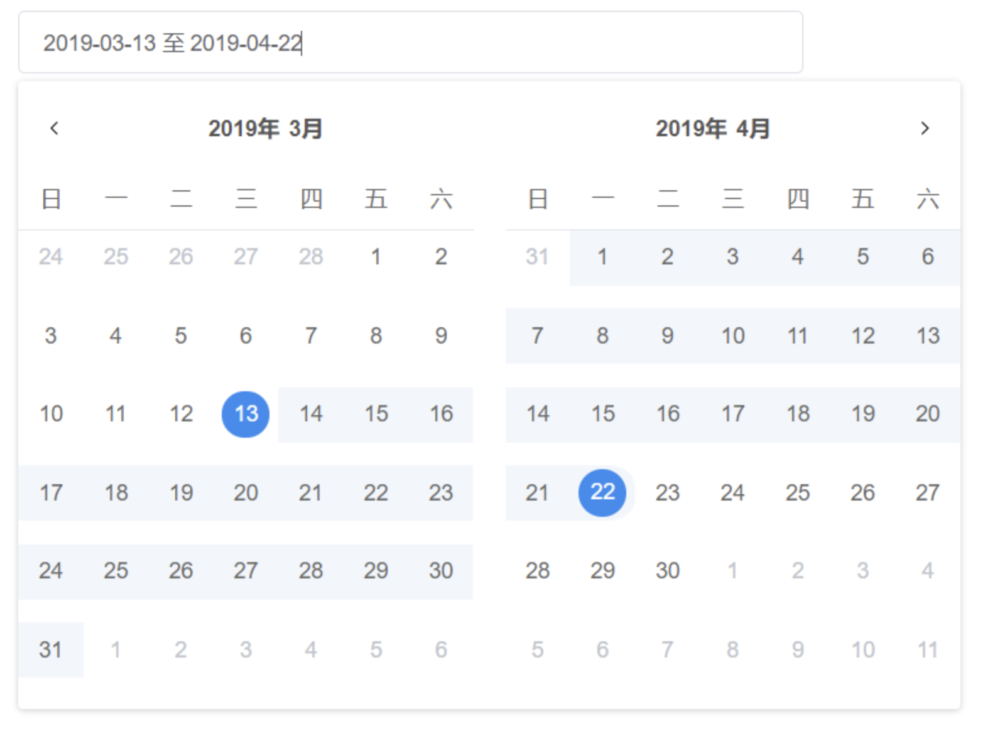
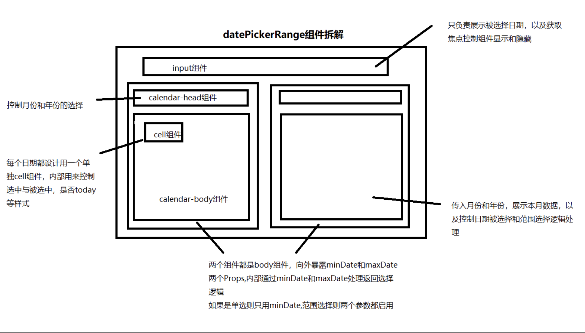

# 手写一个dataPicker组件(日期选择组件)

  本文是之前在手写vue组件库中的一些经历，之前有写table,select等，date-picker算是较为复杂的组件是心啊，本文只是梳理一下组件实现思路，其中也借鉴了element-ui和iview两个库中的datePicker组件实现思路


## 日历组件功能一览

### 功能

  - 支持单选日期
  - 时间范围选择

### 实现要点
  
  - 计算每个月的天数，以及补上个月的日期以及下个月的日期
  - Range组件，时间范围，鼠标移入和移出计算出中日历中的range区域实现高亮
  - Range组件，跨月选择日期时，数据处理
  

[点击体验日历效果](https://huqc2513.github.io/component/#/calendar)

 #### DatePickerRange组件
 
 <br>


## 组件划分和功能图解
 
  从以上几个要点，设计整个组件的结构组织

  - **DateCalendarRange组件**

    采用两个body组件+一个外层组件组合
  
  - **DateCalendar组件**
  
   划分为body组件即可，body组件即可满足单选功能

 ### 图解
 
 <br>


 ## 计算本月天数数据和下一个月的天数数据

  日历一般是42个格子，假设日历默认是从周日开始，有些月份1号是周六，一些是周一，要预留中间的前面上个月的日期个数差值，取得日历数据的步骤
  1. 求上个月需要补的日期数
  2. 求本月的天数
  3. 求下月要补的天数


``` js
//伪代码  计算上个月公式,  每计算一天，i会加一天  
      for(let i=1;i<=42;i++){
          (上个月最后一天  - 本月第一天的星期数 ) + i  
      }
```
  
  [代码实现](https://github.com/huqc2513/component/blob/master/src/components/calendar/newCalendar/date.js)

## c-body组件实现（核心实现）
  
  body组件是整个日历组件的核心，它负责渲染整个月份，且需要处理日历的`click`事件，与`mousermove`事件的业务


  **日期渲染过程**

  通过将单月的日历数据切分为7*6的二维数组，采用table布局，使用两层v-for渲染，并且将每层的下标挂载到元素上，每个元素上放置着当前日期的数据


   ### 接口设计
  - 组件设计为向外暴露minDate和maxDate两个props属性

      用来控制选择日期的区间高亮  
  
  - 内部保留一个startTime和endTime

    方便在鼠标move时，改变数据，不需要emit到外部。且可以用于watch 自身的startTime和endTime，每次改变时去emit父级组件改变minDate和maxDate就可以了。这样也实现了数据双向流通

 ### 实现功能思路拆解
  
  - **每一个日期click处理**

    点击每一个日期的处理，需要将每次点击的日期，存放在当前组件的状态，我们组件内部用stateTime和endTime来表示，且watch这两个属性的变化，每次有变化时，派发到外部组件去通知修改minDate和maxDate，

    如果是单选，就只保留一个minDate,如果是范围选择，就只保留两个，超过则清空

  - **c-body的mousemove处理（难点）**

    设计思路是，在鼠标move过程中，计算移入的div，拿到日期数据，并且和startTime和endTime做比较，来判断修改哪一个值实现高亮

    [点击查看鼠标移入日历，高亮区间效果](https://huqc2513.github.io/component/#/calendar)

    需要实现鼠标移入，从startTime到鼠标移动到的日期，中间间隔的的日期全部高亮

    我们采用修改日期数据列表的方式来达到，这一步其实很简单，移动过程中，拿到目标元素中绑定的row和column下标，取得元素中的Date,将Date和startTime比较，如果比 StartTime大，就设置为endTime就行。
    

 ## 一些其他的问题

  整个组件中的重点实现已经记录完了，类似head组件和cell组件只剩下一些props声明和简单的判断year,month条件等，目前也留下了一些问题，有待重构部分代码

  - 当前移动的目标Date比StartDate小该如何优雅的处理？

    如今的mousemove事件处理，设计思路是，在鼠标move过程中，计算移入的div，拿到日期数据（element-ui-datepickerRange组件内部实现思路也是如此）
    
    如果移动获取到的Date比StartDate小，代表鼠标在往回移动，在move事件中置换两个变量，会出现startTime和endTime每次只差一天的情况，因为目前组件设计只采用start和end两个标志点，在move事件中是如果是反方向移动，是没法置换start和end的，是否需要推翻之前的设计，重新设立第三个标志点来控制区间选择
  
    目前的处理思路
    
    只考虑startDate和endDate只是代表着一个区间，能拿到这个区间，就可以实现高亮了，我们在cell组件内部，每一个日期绑定class的时候，手动判断一次startDate和endDate的大小就可以了，如果start比end大，则互相替换一下需要添加class元素的位置就可以了，不需要直接修改start和end 


## 后记

  这篇手记基本就是用来记录其实现过程的一些思路，没有任何代码展示，对于复杂组件，业务逻辑，往往只需要将业务梳理清楚了，代码就好写很多了
  

    
[点击查看日历组件码地址](https://github.com/huqc2513/component/tree/master/src/components/calendar/newCalendar)


  

 
  

    
    


