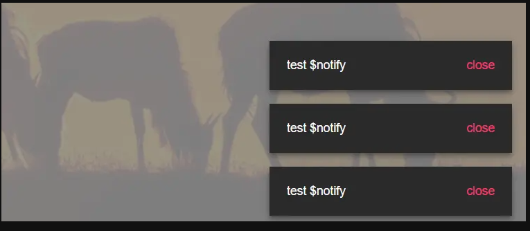

# vue中的extend API

平时我们写vue组件都是template形式，然后Import导入注册来使用，其实vue创建组件的方式还有另外一种，在对于notification、弹层等这种通知组件，我们希望使用更加另外灵活，类似于window.alert这样调用，并不想每次使用都需要注册components, 我们可以使用 Vue.extend 构造器来创建组件，把它封装为单独的vue插件，在任何vue项目中都能use使用，也能发布为单独的npm包，在对notification组件的实现分析上，掌握对于vue的extend知识点实际应用

## extend使用方法
``` js
  import Vue from 'vue'
  import Component from './func-notification'
  //返回一个扩展实例构造器
  const NotificationConstructor = Vue.extend(Component)
```


  先看看静态图组件完成后的效果。组件是采用调用方法开控制调用和隐藏的，出现两秒钟后自动消失，鼠标移入到通知弹层里面暂停消失动作，连续多次调用方法，组件会层叠堆加上去

  **组件的使用方式**
  ``` js
  //Notification里面需要暴露install方法，才能使用use
    Vue.use(Notification)

  //在任意组件中使用
    this.$notify({
          content: 'test $notify',
          btn: 'close',
          autoClose:2000
      })
  ```

  


## 目录结构

- notification.vue      &nbsp;&nbsp;&nbsp;&nbsp; 模版文件，里面用来写html和css
- func-notification.js    &nbsp;&nbsp;&nbsp;        使用vue的extends选项将notification.vue组件扩充
- function  &nbsp;&nbsp;&nbsp;                       组件实例函数，向外部导出构造方法
- index.js &nbsp;&nbsp;&nbsp;              注册组件，挂载组件


## notification.vue （模版组件）

实现布局与样式，同时监听了点击事件，和动画结束钩子，分别向外派发了组件关闭和组件销毁emit，以及在鼠标移入时创建定时器，移除时销毁定时器

``` js
<template>
  <transition name="fade" @after-leave="afterLeave" @after-enter="afterEnter">
    <div
      class="notification"
      :style="style"
      v-show="visible"
      @mouseenter="clearTimer"
      @mouseleave="createTimer"
    >
      <span class="content">{{content}}</span>
      <a class="btn" @click="handleClose">{{btn}}</a>
    </div>
  </transition>
</template>

<script>
export default {
  name: 'Notification',
  props: {
    content: {
      type: String,
      required: true
    },
    btn: {
      type: String,
      default: '关闭'
    }
  },
  data () {
    return {
      visible: true
    }
  },
  computed: {
    style () {
      return {}
    }
  },
  methods: {
    handleClose (e) {
      e.preventDefault()
      this.$emit('close')
    },
    afterLeave () {
      this.$emit('closed')
    },
    afterEnter () {},
    clearTimer () {},
    createTimer () {}
  }
}
</script>

<style lang="stylus" scoped>
.notification
  display: inline-flex
  background-color #303030
  color rgba(255, 255, 255, 1)
  align-items center
  padding 20px
  min-width 280px
  box-shadow 0px 3px 5px -1px rgba(0, 0, 0, 0.2), 
  0px 6px 10px 0px rgba(0, 0, 0, 0.14), 
  0px 1px 18px 0px rgba(0, 0, 0, 0.12)
  flex-wrap wrap
  transition all .3s
.content
  padding 0
.btn
  color #ff4081
  padding-left 24px
  margin-left auto
  cursor pointer
</style>
```

## func-notification.js (单独实现业务)
 extends继承组件，单独实现其业务逻辑，根据组件实例上的`verticalOffset`设置计算属性求得组件的bottom定位，

``` js
import Notification from './notification.vue'

export default {
  //继承模版的所有选项，重写
  extends: Notification,
  //用于动态给到bottom定位
  computed: {
    style () {
      return {
        position: 'fixed',
        right: '20px',
        bottom: `${this.verticalOffset}px`
      }
    }
  },
  mounted () {
    //用于开始计算倒计时
    this.createTimer()
  },
  methods: {
    createTimer () {
      //autoClose值在props里面已经传进来了
      if (this.autoClose) {
        this.timer = setTimeout(() => {
          this.visible = false
        }, this.autoClose)
      }
    },
    clearTimer () {
      if (this.timer) {
        clearTimeout(this.timer)
      }
    },
    afterEnter () {
      this.height = this.$el.offsetHeight
    }
  },
  beforeDestory () {
    //组件销毁之前清除定时器
    this.clearTimer()
  },
  data () {
    return {
      verticalOffset: 0,
      autoClose: 3000,
      height: 0,
      visible: false
    }
  }
}

```

## function.js (管理实例)

向外导出一个notify方法，使用Vue.extend(Component)返回构造器，每次调用notify方法都会创建新的notification实例，用数组保存实例

监听每一个实例的关闭和销毁事件,以及实现移除实例的方法，改变实例上的verticalOffset高度来控制多个实例组件淡出动画


``` js
import Vue from 'vue'
import Component from './func-notification'

//返回一个扩展实例构造器
const NotificationConstructor = Vue.extend(Component)
const instances = []
let seed = 1

const removeInstance = (instance) => {
  if (!instance) return
  const len = instances.length
    //findIndex() 方法   为数组中的每个元素都调用一次函数执行     instances为实例数组
  const index = instances.findIndex(inst => instance.id === inst.id)
  instances.splice(index, 1)
  if (len <= 1) return
//拿到组件的高低 ，vm就是dom
  const removeHeight = instance.vm.height 
  for (let i = index; i < len - 1; i++) {
    instances[i].verticalOffset =
//组件的verticalOffset高度 - 自身高度- 下边的间距
      parseInt(instances[i].verticalOffset) - removeHeight - 16
  }
}

const notify = (options) => {
  const {
    autoClose,
    ...rest
  } = options

  //使用propsData  为组件传递props
  const instance = new NotificationConstructor({
    propsData: {
      ...rest
    },
    data: {
      autoClose: autoClose === undefined ? 3000 : autoClose
    }
  })

  //每次调用函数 id+1
  const id = `notification_${seed++}`
  instance.id = id
  //生成dom节点并且挂载到body下
  instance.vm = instance.$mount()
  document.body.appendChild(instance.vm.$el)

  //设置值为显示dom
  instance.vm.visible = true
  let verticalOffset = 0

  //在每个实例上挂在这里的元素高度           第一个实例高度为0
  instances.forEach(item => {
    // offsetHeight 它返回该元素的像素高度     
    verticalOffset += item.$el.offsetHeight + 16
  })
 //首个和最后一个下边框留16个像素
  verticalOffset += 16
  instance.verticalOffset = verticalOffset
  instances.push(instance)
  //监听销毁组件关闭事件
  instance.vm.$on('closed', () => {
    removeInstance(instance)
  //移除dom
    document.body.removeChild(instance.vm.$el)
    //销毁组件
    instance.vm.$destroy()
  })

  //监听关闭组件事件
  instance.vm.$on('close', () => {
    instance.vm.visible = false
  })
  return instance.vm
}

export default notify

```

## vue插件封装
导出组件，挂载在vue实例上
  
``` js
import Notification from './notification.vue'
import notify from './function'

export default (Vue) => {
  Vue.component(Notification.name, Notification)
  Vue.prototype.$notify = notify
}
```

## 使用 
``` js
 //main.js中注册组件
   Vue.use(Notification)

//在任意组件中使用
   this.$notify({
        content: 'test $notify',
        btn: 'close',
        autoClose:2000
    })
```


